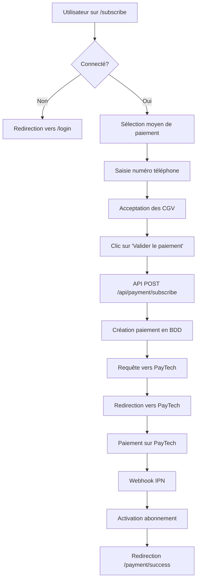

# Mise à jour de l'abonnement - 150 XOF/mois

## Résumé des changements

L'abonnement mensuel de la plateforme Big Five a été mis à jour avec les modifications suivantes :

### 💰 Nouveau prix
- **Ancien prix** : 4 500 XOF/mois
- **Nouveau prix** : 150 XOF/mois
- **Durée** : 1 mois (30 jours)

### 📁 Fichiers modifiés

#### 1. Pages de tarification et d'affichage
- ✅ `/app/pricing/page.tsx` - Prix mis à jour à 150 XOF
- ✅ `/app/subscribe/page.tsx` - Intégration PayTech complète
- ✅ `/app/paywall/page.tsx` - Prix mis à jour (150 XOF/mois, 5 XOF/jour)
- ✅ `/components/landing/hero-section.tsx` - Prix mis à jour partout

#### 2. Intégration PayTech
- ✅ **Nouveau** : `/app/api/payment/subscribe/route.ts`
  - Endpoint API pour créer un paiement d'abonnement
  - Prix : 150 XOF
  - Durée : 30 jours
  - Support de tous les moyens de paiement PayTech
  
- ✅ **Modifié** : `/app/api/payment/ipn/route.ts`
  - Ajout de la gestion des abonnements
  - Activation automatique de l'abonnement après paiement réussi
  - Mise à jour des champs `subscription_status`, `subscription_start_date`, `subscription_end_date`

- ✅ **Modifié** : `/app/subscribe/page.tsx`
  - Intégration du hook `useSupabaseAuth`
  - Redirection automatique vers login si non connecté
  - Appel à l'API `/api/payment/subscribe`
  - Support de Mobile Money (Orange, MTN, Moov, Wave)
  - Support de Carte Bancaire

### 🔄 Flux de paiement



### 🎯 Fonctionnalités

#### Moyens de paiement supportés
1. **Mobile Money**
   - Orange Money
   - MTN Mobile Money
   - Moov Money
   - Wave

2. **Carte Bancaire**
   - Visa
   - Mastercard

#### Sécurité
- ✅ Vérification de l'authentification utilisateur
- ✅ Vérification IPN avec HMAC-SHA256
- ✅ Validation des paiements côté serveur
- ✅ Protection contre les doubles abonnements

#### Base de données
Les champs suivants sont mis à jour dans la table `users` après paiement réussi :
- `subscription_status` → 'active'
- `subscription_start_date` → Date du paiement
- `subscription_end_date` → Date + 30 jours
- `updated_at` → Timestamp actuel

### 🔧 Configuration requise

#### Variables d'environnement
Assurez-vous que ces variables sont configurées dans `.env` ou `.env.local` :

```env
# PayTech Configuration
PAYTECH_API_KEY=your_api_key
PAYTECH_API_SECRET=your_api_secret
PAYTECH_ENV=test  # ou 'prod' pour la production
NEXTAUTH_URL=http://localhost:3000  # URL de base de l'application
```

### 📊 Structure de la table `payments`

Les paiements d'abonnement sont enregistrés avec les métadonnées suivantes :

```json
{
  "type": "subscription",
  "duration_days": 30,
  "subscription_end_date": "2026-03-14T...",
  "item_name": "Abonnement Big Five - 1 mois",
  "phoneNumber": "+225XXXXXXXXXX"
}
```

### 🧪 Tests

#### Test en mode développement

1. Démarrez le serveur :
```bash
pnpm dev
```

2. Accédez à `/subscribe`

3. Connectez-vous (obligatoire)

4. Sélectionnez un moyen de paiement

5. Remplissez le formulaire

6. Cliquez sur "Valider le paiement"

7. Vous serez redirigé vers PayTech (environnement test)

#### URLs de test PayTech
- **Test** : https://paytech.sn/test/payment/...
- **Prod** : https://paytech.sn/payment/...

### ✅ Points de vérification

- [x] Prix mis à jour à 150 XOF partout
- [x] Durée d'abonnement : 1 mois (30 jours)
- [x] Intégration PayTech complète
- [x] Gestion des webhooks IPN
- [x] Activation automatique de l'abonnement
- [x] Support Mobile Money et Carte Bancaire
- [x] Redirection après paiement
- [x] Vérification de l'authentification

### 📝 Notes importantes

1. **Types TypeScript** : Certaines erreurs TypeScript avec Supabase sont normales et contournées avec `as any`. Pour une production, il faudrait générer les types Supabase corrects.

2. **Webhooks** : Assurez-vous que l'URL IPN est accessible publiquement en production (pas de localhost).

3. **Environnement** : Changez `PAYTECH_ENV=prod` en production.

4. **Tests** : Testez d'abord en mode `test` avant de passer en production.

### 🚀 Déploiement

Avant de déployer en production :

1. Vérifiez les clés API PayTech (mode prod)
2. Configurez les variables d'environnement sur Vercel
3. Testez les webhooks IPN avec une URL publique
4. Vérifiez que la table `users` a les colonnes d'abonnement
5. Testez un paiement complet en mode test

### 📞 Support

En cas de problème avec PayTech :
- Documentation : https://doc.intech.sn/doc_paytech.php
- Email support : support@paytech.sn

---

**Date de mise à jour** : 12 février 2026  
**Version** : 1.0.0
