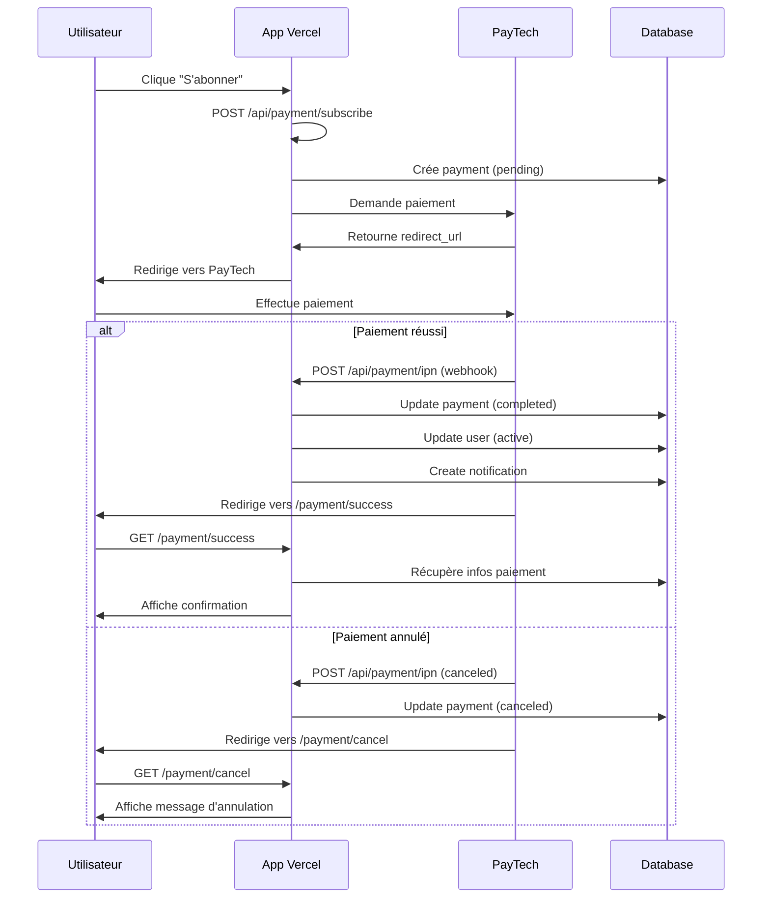

# 🚀 Configuration PayTech pour Vercel - URLs de Production

## 📍 Site déployé
**URL Production** : https://v0-big-five-bootcamp-platform.vercel.app

## ✅ URLs PayTech configurées

### 1️⃣ URL de notification instantanée de paiement (IPN)
```
https://v0-big-five-bootcamp-platform.vercel.app/api/payment/ipn
```
**Route API** : `/app/api/payment/ipn/route.ts`

**Fonction** :
- Reçoit les webhooks PayTech après chaque transaction
- Vérifie la signature pour sécurité
- Met à jour le statut du paiement en base
- Active l'abonnement de l'utilisateur
- Crée une notification de succès/échec

---

### 2️⃣ URL de redirection en cas de succès
```
https://v0-big-five-bootcamp-platform.vercel.app/payment/success
```
**Page** : `/app/payment/success/page.tsx`

**Fonction** :
- Affiche la confirmation de paiement
- Récupère les détails de l'abonnement
- Affiche les prochaines étapes
- Permet de télécharger la confirmation

---

### 3️⃣ URL de redirection en cas d'annulation
```
https://v0-big-five-bootcamp-platform.vercel.app/payment/cancel
```
**Page** : `/app/payment/cancel/page.tsx`

**Fonction** :
- Informe l'utilisateur de l'annulation
- Propose de réessayer le paiement
- Nettoie les données temporaires

---

## 🔧 Configuration dans Vercel Dashboard

### Étape 1 : Ajouter les variables d'environnement

1. Allez sur https://vercel.com/dashboard
2. Sélectionnez votre projet **v0-big-five-bootcamp-platform**
3. Cliquez sur **Settings** > **Environment Variables**
4. Ajoutez les variables suivantes :

#### Variables Supabase
```
NEXT_PUBLIC_SUPABASE_URL=https://votre-projet.supabase.co
NEXT_PUBLIC_SUPABASE_ANON_KEY=votre_anon_key
SUPABASE_SERVICE_ROLE_KEY=votre_service_role_key
```

#### Variables PayTech
```
PAYTECH_API_KEY=votre_api_key
PAYTECH_API_SECRET=votre_api_secret
PAYTECH_ENV=test
```

#### URLs de callback
```
NEXT_PUBLIC_APP_URL=https://v0-big-five-bootcamp-platform.vercel.app
PAYTECH_SUCCESS_URL=https://v0-big-five-bootcamp-platform.vercel.app/payment/success
PAYTECH_CANCEL_URL=https://v0-big-five-bootcamp-platform.vercel.app/payment/cancel
PAYTECH_IPN_URL=https://v0-big-five-bootcamp-platform.vercel.app/api/payment/ipn
```

### Étape 2 : Redéployer

Après avoir ajouté les variables :
1. Cliquez sur **Deployments**
2. Trouvez le dernier déploiement
3. Cliquez sur les **...** > **Redeploy**
4. Ou poussez un nouveau commit sur GitHub

---

## 🔐 Configuration dans PayTech Dashboard

### Étape 1 : Se connecter à PayTech
1. Allez sur https://paytech.sn/dashboard
2. Connectez-vous avec vos identifiants

### Étape 2 : Configurer les URLs de callback

1. Menu **API / Intégration**
2. Section **URLs de notification**
3. Remplissez :

```
URL IPN (Webhook) : https://v0-big-five-bootcamp-platform.vercel.app/api/payment/ipn
URL de succès     : https://v0-big-five-bootcamp-platform.vercel.app/payment/success
URL d'annulation  : https://v0-big-five-bootcamp-platform.vercel.app/payment/cancel
```

4. Cliquez sur **Enregistrer**

### Étape 3 : Tester en mode Test

En mode **Test**, vous pouvez utiliser des numéros de test PayTech pour vérifier que tout fonctionne.

---

## 🧪 Test des URLs

### Test 1 : Vérifier que l'IPN est accessible

```bash
curl -I https://v0-big-five-bootcamp-platform.vercel.app/api/payment/ipn
```

**Résultat attendu** :
```
HTTP/2 405 Method Not Allowed
```
(C'est normal, seul POST est accepté)

### Test 2 : Page de succès accessible

```bash
curl -I https://v0-big-five-bootcamp-platform.vercel.app/payment/success
```

**Résultat attendu** :
```
HTTP/2 200 OK
```

### Test 3 : Page d'annulation accessible

```bash
curl -I https://v0-big-five-bootcamp-platform.vercel.app/payment/cancel
```

**Résultat attendu** :
```
HTTP/2 200 OK
```

---

## 📊 Routes API créées

### Route IPN (Webhook)
**Fichier** : `/app/api/payment/ipn/route.ts`

```typescript
export async function POST(request: Request) {
  // 1. Vérifier la signature PayTech
  // 2. Récupérer les données de paiement
  // 3. Mettre à jour le statut dans la base
  // 4. Activer l'abonnement si succès
  // 5. Créer une notification
  return NextResponse.json({ success: true });
}
```

**Statuts gérés** :
- ✅ `completed` - Paiement réussi
- ❌ `canceled` - Paiement annulé
- 💰 `refunded` - Paiement remboursé

### Route Subscribe
**Fichier** : `/app/api/payment/subscribe/route.ts`

```typescript
export async function POST(request: NextRequest) {
  // 1. Récupérer les données utilisateur
  // 2. Créer l'enregistrement de paiement
  // 3. Générer la demande PayTech
  // 4. Retourner l'URL de redirection
}
```

---

## 🔄 Flux complet de paiement



---

## 🔍 Déboguer les webhooks IPN

### Dans Vercel Dashboard

1. **Logs en temps réel**
   - Allez dans **Deployments** > **Cliquez sur le déploiement actif**
   - Onglet **Functions** > Cliquez sur `/api/payment/ipn`
   - Voir les logs d'exécution

2. **Monitoring**
   - Menu **Analytics** ou **Monitoring**
   - Voir les erreurs 500 ou timeouts

### Dans PayTech Dashboard

1. **Historique des webhooks**
   - Menu **Transactions**
   - Cliquez sur une transaction
   - Voir le statut du webhook IPN (✅ Envoyé, ❌ Échec)

2. **Réessayer un webhook**
   - Si échec, bouton **Renvoyer la notification**

---

## 📋 Checklist de déploiement

### Configuration Vercel
- [ ] Variables d'environnement Supabase ajoutées
- [ ] Variables d'environnement PayTech ajoutées
- [ ] URLs de callback configurées
- [ ] Application redéployée
- [ ] Tests des routes API (200/405 OK)

### Configuration PayTech
- [ ] Compte PayTech créé
- [ ] API Keys générées (test ou production)
- [ ] URL IPN configurée dans le dashboard
- [ ] URL de succès configurée
- [ ] URL d'annulation configurée
- [ ] Mode test activé pour les tests

### Tests fonctionnels
- [ ] Page `/subscribe` accessible
- [ ] Sélection de pays/opérateur fonctionne
- [ ] Redirection vers PayTech réussie
- [ ] Webhook IPN reçu et traité
- [ ] Statut de paiement mis à jour
- [ ] Abonnement activé dans la base
- [ ] Notification créée
- [ ] Page de succès affiche les bonnes infos

---

## 🚨 Problèmes courants

### 1. Webhook IPN non reçu

**Causes possibles** :
- URL mal configurée dans PayTech
- Fonction Vercel timeout (10s max gratuit)
- Erreur 500 dans le traitement

**Solution** :
1. Vérifiez les logs Vercel
2. Testez l'URL IPN manuellement
3. Vérifiez la configuration PayTech

### 2. Signature invalide

**Erreur** :
```
Invalid PayTech signature
```

**Solution** :
- Vérifiez `PAYTECH_API_SECRET` dans Vercel
- Doit correspondre exactement à PayTech dashboard

### 3. Variables d'environnement non chargées

**Solution** :
1. Redéployez après ajout des variables
2. Variables doivent être en **Production** et **Preview**

---

## 🎯 URLs finales configurées

| Type | URL |
|------|-----|
| **Site** | https://v0-big-five-bootcamp-platform.vercel.app |
| **IPN** | https://v0-big-five-bootcamp-platform.vercel.app/api/payment/ipn |
| **Succès** | https://v0-big-five-bootcamp-platform.vercel.app/payment/success |
| **Annulation** | https://v0-big-five-bootcamp-platform.vercel.app/payment/cancel |
| **Subscribe** | https://v0-big-five-bootcamp-platform.vercel.app/subscribe |

---

## 📞 Support

### Vérifier les logs Vercel
```bash
vercel logs
```

### Tester localement avec ngrok (développement)
Voir le guide `QUICK_FIX_HTTPS.md`

---

**Date de configuration** : 12 février 2026
**Environnement** : Production Vercel
**Status** : ✅ URLs configurées et prêtes
